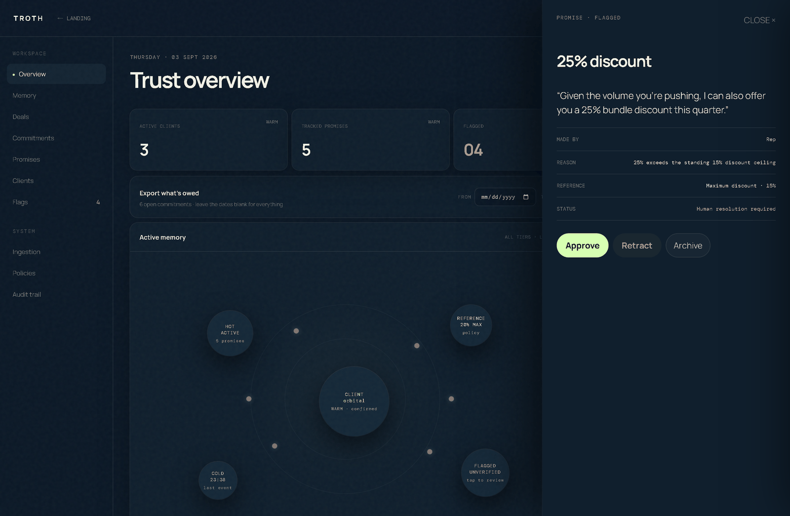
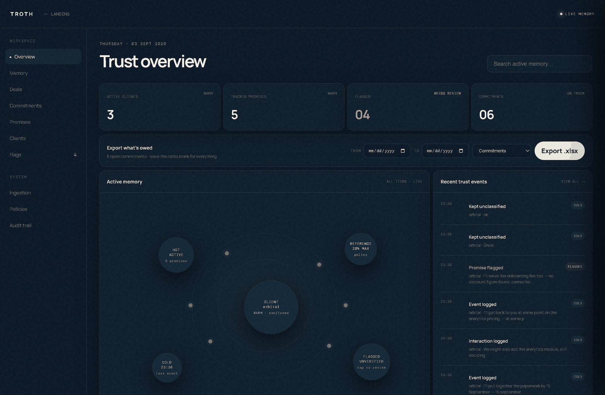
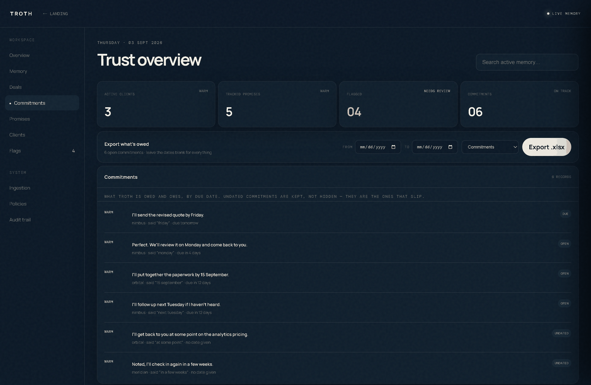
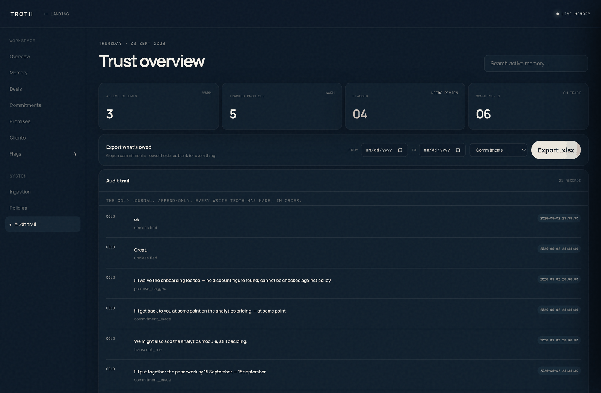
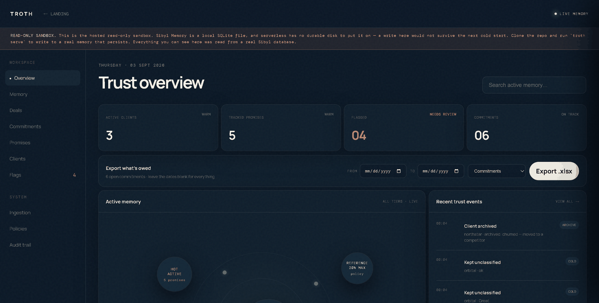
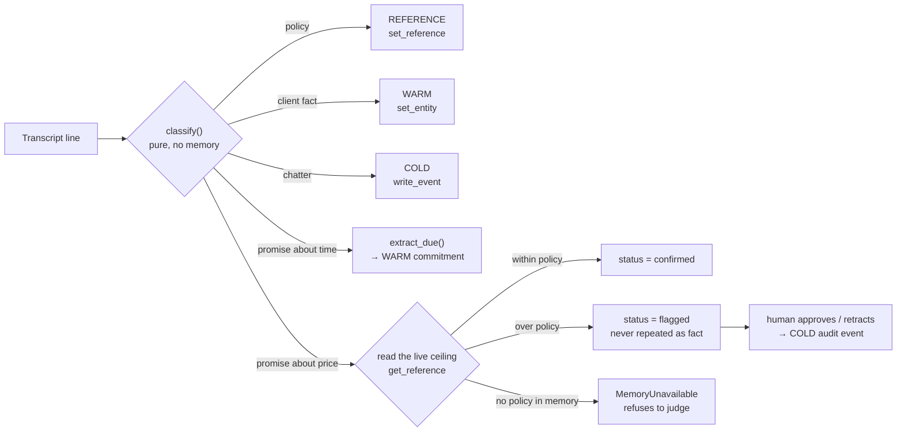
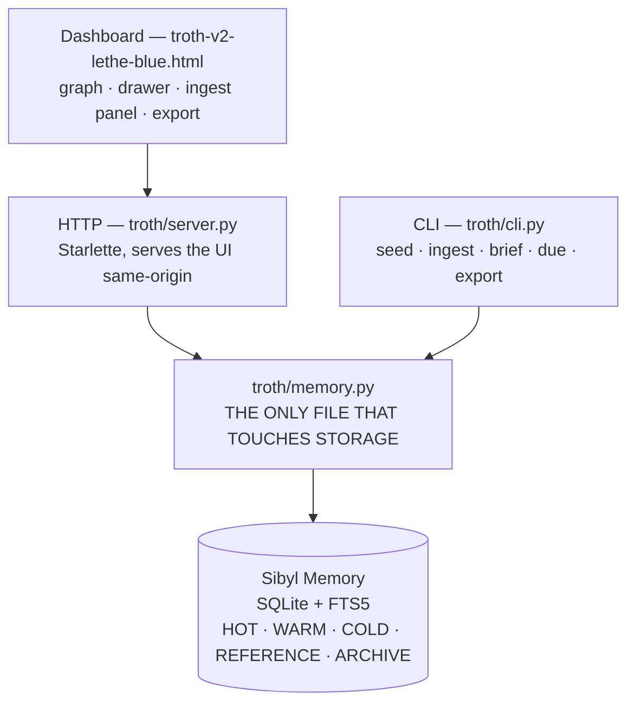

<div align="center">


# Troth

[](LICENSE)


[](https://sybl-eosin.vercel.app)


### *A pledged word.*

### Remembers what was promised. **Refuses to repeat a promise it hasn't verified.**

Reps lose deals because nobody remembers what was said three calls ago — a discount promised, a deadline agreed, a scope committed to. Troth reads your call transcripts, routes every line into the tier it belongs in, and checks each promise against standing policy **at the moment it is made**. A promise that breaks policy is downgraded to `flagged` and Troth will not repeat it as fact until a human decides. Archive a client and it refuses to brief you on them at all.

**[ Live sandbox ↗ ](https://sybl-eosin.vercel.app)** · **[ The load-bearing moment ↗ ](#where-memory-is-load-bearing)** · **[ Verify it in 60 seconds ↗ ](#verify-it-yourself-in-60-seconds)** · **[ Run it ↗ ](#run-it)** · **[ Honesty table ↗ ](#whats-real-and-whats-not)**

Built for the **[Sibyl Labs Hackathon](https://hack.sibyllabs.org)** · Sep 1–10, 2026.

</div>

---

## The load-bearing moment, in one picture

A rep offered 25% off. The standing ceiling in REFERENCE says 15%. Troth read that ceiling **at the moment the promise was made**, downgraded the promise to `flagged`, and will not repeat it as an agreed fact until a human approves or retracts it.



| Trust overview | Commitments, by due date |
|---|---|
|  |  |
| Every figure is read from Sibyl on request — no cache, no snapshot table | Parsed deadlines, with vague ones kept as `UNDATED` rather than invented |

| Ingestion | COLD audit trail |
|---|---|
|  |  |
| Paste or upload a transcript; every line is routed and shown with its reason | Append-only. Every write Troth has made, in order |

Deep links work throughout: `#dashboard/commitments` opens a view, and `#promise/<id>` opens one flagged promise — a shareable link to the exact thing needing a decision.

---

## Table of contents

- [The load-bearing moment, in one picture](#the-load-bearing-moment-in-one-picture)
- [What it does](#what-it-does)
- [Where memory is load-bearing](#where-memory-is-load-bearing)
- [Verify it yourself in 60 seconds](#verify-it-yourself-in-60-seconds)
- [The hosted sandbox, and what it cannot prove](#the-hosted-sandbox-and-what-it-cannot-prove)
- [The trust gate](#the-trust-gate)
- [Commitments — promises about time](#commitments--promises-about-time)
- [Architecture](#architecture)
- [How memory made this possible](#how-memory-made-this-possible)
- [Memory implementation note](#memory-implementation-note)
- [Partner stacks](#partner-stacks)
- [What's real and what's not](#whats-real-and-whats-not)
- [Run it](#run-it)
- [Tests](#tests)
- [Project layout](#project-layout)
- [Prior work declaration](#prior-work-declaration)
- [Team](#team)

---

## What it does

Troth is a sales copilot with a memory it is accountable to. You paste or upload a call transcript; a deterministic router classifies every line and writes it into the Sibyl tier where it belongs — client facts to WARM, the timeline to COLD, pricing policy to REFERENCE, deal state to HOT. When it hits a promise, it reads the standing discount ceiling out of REFERENCE and checks the promise against it right then. Under the ceiling, the promise is stored `confirmed`. Over it, the promise is stored `flagged`, and from that moment Troth will not repeat it as an agreed fact — not in the pre-call brief, not in search, not anywhere — until a human approves or retracts it. Promises about *time* ("I'll send the quote by Friday") get a parsed due date instead, and the brief tells you how overdue you are. Archive a client and they leave the read path entirely, so the agent cannot suggest re-pitching someone who already churned.

## Where memory is load-bearing

**Every read and write Troth performs is in one file: [`troth/memory.py`](troth/memory.py).** Nothing else in the codebase touches storage. Each call is tagged with a `# SIBYL <TIER>` comment, so `grep -n "SIBYL " troth/memory.py` prints the complete critical path in one command.

| Tier | Sibyl SDK call | What Troth keeps there | Where |
|---|---|---|---|
| **HOT** | `set_state` / `get_state` | Live deal stage | [memory.py:172](troth/memory.py#L172), [:176](troth/memory.py#L176) |
| **WARM** | `set_entity` / `get_entity` / `list_entities` | Clients, promises, dated commitments | [:98](troth/memory.py#L98), [:277](troth/memory.py#L277), [:350](troth/memory.py#L350) |
| **COLD** | `write_event` / `read_events` | Append-only interaction + audit journal | [:209](troth/memory.py#L209), [:216](troth/memory.py#L216) |
| **REFERENCE** | `set_reference` / `get_reference` | Standing pricing policy | [:113](troth/memory.py#L113), [:129](troth/memory.py#L129) |
| **ARCHIVE** | `archive_entity` | Churned clients, out of the read path | [:384](troth/memory.py#L384) |
| *search* | `search_entities` / `search` | FTS5 across tiers | [:412](troth/memory.py#L412), [:156](troth/memory.py#L156) |

**The single most load-bearing line** is [`current_max_discount()` at memory.py:116](troth/memory.py#L116). It reads the discount ceiling out of REFERENCE on **every** promise check, and it has **no default**:

```python
raise MemoryUnavailable(
    f"No discount ceiling in REFERENCE under {MAX_DISCOUNT_KEY!r}. "
    "Troth cannot check a promise against a policy it does not have."
)
```

A hardcoded fallback here would let the entire trust gate keep working with the database deleted. That is exactly what the deletion test looks for, so there isn't one. **With no memory, Troth does not guess — it refuses.**

> `flagged` is **not** a sixth Sibyl tier. Sibyl Memory has five. `status` is a *native field* on Sibyl's WARM entities (`set_entity(..., status="flagged")`, `list_entities(..., status=...)`), and Troth uses it to carry its own trust label. Sibyl stores the value; deciding what it means and refusing to act on it is Troth's logic.

## Verify it yourself in 60 seconds

Every claim above is checkable from a terminal. After [installing](#run-it):

```bash
# 1. THE DELETION TEST — an empty database, so no verdict is possible
troth --db ./fresh.db ingest examples/promise-only.txt --client meridian
#    WARM  flagged   Given the volume you're pushing, I can offer you a 25% b
#                    -> unverifiable — no discount ceiling in reference

# 2. Seed the policy. The same line now gets a real verdict.
troth seed --max-discount 15
troth ingest examples/promise-only.txt --client meridian
#    WARM  flagged   Given the volume you're pushing, I can offer you a 25% b
#                    -> 25% exceeds the standing 15% discount ceiling

# 3. THE ANSWER CHANGES. Move the ceiling; re-check the identical line.
troth seed --max-discount 30
troth ingest examples/promise-only.txt --client meridian
#    WARM  confirmed Given the volume you're pushing, I can offer you a 25% b
#                    -> 25% is within the standing 30% ceiling

# 4. COLD-START RECALL — a brand new process, nothing in RAM
troth ingest examples/meridian-call.txt --client meridian
troth brief meridian
#    CLIENT / POLICY / open commitments / promises NOT confirmed — all off disk

# 5. THE ARCHIVE REFUSAL — it will not re-pitch a churned client
troth ingest examples/northstar-churn.txt --client northstar
troth archive northstar --reason "churned"
troth brief northstar
#    'northstar' is not in active memory. It may have been archived —
#    Troth will not suggest re-pitching it.
```

Step 3 is the one that matters most: **the same input produces a different answer because a value in memory changed.** Not logged differently — answered differently.

> Steps 1–3 deliberately use `examples/promise-only.txt`, a single promise line with no policy in it. The fuller transcripts *state their own policy* ("our standard policy allows a 15% early-renewal discount"), which Troth writes to REFERENCE as it reads — so ingesting one of those overwrites the ceiling you just seeded and the promise would not flip. That behaviour is correct; it just makes for a confusing demo.

## The hosted sandbox, and what it cannot prove

**[sybl-eosin.vercel.app](https://sybl-eosin.vercel.app)** — click through the real dashboard, open a flagged promise, download the .xlsx.

It is **read-only**, and that is a property of the host, not of Troth. Sibyl Memory is a local SQLite file; serverless has no durable disk to put one on, so a write there would either fail on the read-only filesystem or succeed and vanish at the next cold start. Rather than let it half-work, the hosted build refuses writes with an explanation and says so in a banner:



**So the live URL is not evidence for the gate, and is not offered as any.** A judge who ingested a transcript there, refreshed, and found it gone would reasonably conclude the memory layer is not load-bearing — the opposite of what is true. Persistence and cold-start recall are demonstrated locally, with [the commands above](#verify-it-yourself-in-60-seconds) and in the demo video. Everything the sandbox *displays* was read out of a real Sibyl database, seeded from the transcripts in `examples/`.

## The trust gate



Routing order matters. Policy is matched **before** commitment, because *"our standard policy allows a 15% discount"* contains discount language but binds nobody. The naive ordering reads it as a promise — which invents a commitment nobody made **and** loses the rule every other promise is checked against.

Hedged language is split by whether it commits to anything. *"I might be able to waive the setup fee, not sure yet"* drops below the confidence floor and goes to a human. *"We might expand our data team next quarter"* hedges but commits to nothing, so it stays on the COLD timeline — flagging it would just make the review queue noisy.

## Commitments — promises about time

A promise about price can be checked against policy. A promise about *time* cannot; it just comes due. Troth parses the deadline deterministically — no model call:

| Said | Parsed | Precision |
|---|---|---|
| "by Friday" | next Friday | exact |
| "by end of week" / "EOW" | coming Friday | exact |
| "next Tuesday" | +1 week | exact |
| "by 15 September" | that date (rolls to next year if past) | exact |
| "in 3 days" / "next week" | offset from today | exact / approx |
| **"in a few weeks"** | **no date** | **vague** |
| **"at some point"** | **no date** | **vague** |

A phrase that names no real date keeps the phrase and is marked `UNDATED` rather than being assigned an invented deadline. *"I'll get back to you at some point"* is not a Friday, and pretending it is would be worse than admitting the deadline is soft. **Undated commitments are never filtered out of the export**, even when a date range is set — they are the ones most likely to slip.

```
$ troth due
! 2026-09-04  DUE      nimbus    I'll send the revised quote by Friday.
                       due tomorrow
  2026-09-15  OPEN     orbital   I'll put together the paperwork by 15 September.
                       due in 12 days
  —           UNDATED  orbital   I'll get back to you at some point on analytics
                       no date given
```

Export it to Excel — date-filtered or everything:

```bash
troth export --scope commitments --from 2026-09-01 --to 2026-09-30
troth export --scope all --out pipeline.xlsx   # + flagged, clients, policies, audit
```

The workbook is built from memory at the moment it is requested. There is no export cache and no snapshot table. The date filter deliberately does **not** apply to the COLD journal: those timestamps record when a line was *written*, not when anything is due, so "upcoming audit entries" would be meaningless.

## Architecture



There is no cache layer and no ORM. `troth/server.py` holds no state — every endpoint reads Sibyl on each request, which is why stopping the server and deleting the database empties the dashboard rather than leaving a stale copy behind.

## How memory made this possible

Troth's entire value is that it can be held to something said three calls ago, by a process that no longer exists. That is only possible because the promise, the policy it was checked against, and the verdict all survive independently of the session that produced them — and because Sibyl's tiers let a *standing rule* (REFERENCE) outlive the *deal* (HOT) it constrained, while the audit of what changed (COLD) outlives both.

The trust downgrade in particular could not exist without persistence: `flagged` only means anything if it is still `flagged` tomorrow, in a different process, when someone asks a question that would otherwise be answered with a promise nobody approved. Sibyl's native entity `status` field carries that label directly, and `list_entities(status="flagged")` makes "what is still unresolved" a single indexed read rather than a scan.

## Memory implementation note

**What Troth persists.** Client facts and both kinds of promise as WARM entities; the live deal stage as HOT state; every interaction, flag, resolution and archive as an append-only COLD journal; the standing discount ceiling as a REFERENCE rule; churned clients moved into ARCHIVE. On top of Sibyl's native entity `status` field, Troth writes its own trust vocabulary — `confirmed`, `flagged`, `retracted` for promises, `open` / `kept` for commitments. That vocabulary is Troth's, not a Sibyl feature.

**What it recalls, and when.** The discount ceiling is read from REFERENCE on *every single promise check*, never cached, so editing the rule changes the next verdict without a restart. The pre-call brief reads WARM, HOT, REFERENCE and the commitment list together. Search reads FTS5 across tiers. The archive check runs before any outreach is suggested.

**What decision changes because of it.** Three things, and all three are refusals rather than logs. A promise that exceeds the stored ceiling is never repeated as fact until a human resolves it. A client in ARCHIVE cannot be briefed on or re-pitched. And with no policy in memory at all, Troth declines to issue a verdict instead of falling back to a number compiled into the source.

## Partner stacks

**None used.** No Base and no Virtuals Protocol integration in this build — the multiplier is x1.00. Sibyl Memory is the only external service, and it is mandatory rather than a bonus stack.

## What's real and what's not

Everything in the left column is exercised by the demo and covered by tests.

| Real | Simplified | Not built |
|---|---|---|
| All five Sibyl tiers on a live database | One global discount ceiling, not per-client tiers | Multi-user auth — single local operator |
| Trust downgrade + human resolution, with COLD audit | Deterministic regex classifier, no LLM extraction | CRM sync (Salesforce/HubSpot) |
| Archive removes a client from the read path | English-only date parsing | Email/calendar ingestion |
| Deadline parsing incl. explicit vague handling | Speaker attribution is `Name:` prefix only | Notifications when something comes due |
| .xlsx export built live from memory | Deal stage is set manually, not inferred | A *writable* hosted deployment |
| | Hosted demo is read-only (no durable disk on serverless) | |
| 70 tests against real Sibyl, not mocks | | |

Known limits, stated plainly: the classifier is regex-based, so it will misroute unusual phrasing — the confidence floor sends the uncertain cases to a human rather than guessing, which is the intended failure mode. Conflicting pricing rules resolve last-write-wins, and the flag reason records the ceiling that was live at check time. Re-ingesting the same transcript is idempotent: promise IDs are SHA-1 of the text, so it updates rather than duplicates.

## Run it

Requires Python 3.10+ and a free Sibyl Memory account.

```bash
git clone https://github.com/gracetemmy/troth
cd troth
pip install -e .

# activate Sibyl (opens a browser; free tier, no card)
pip install "sibyl-memory-cli[mcp]"
sibyl init
```

> **Windows note:** `sibyl init` crashes with a `UnicodeEncodeError` because its banner does not fit cp1252. Run `set PYTHONIOENCODING=utf-8` first (or `export` on Git Bash). Troth's own CLI degrades to ASCII instead of dying.

```bash
troth seed --max-discount 15                              # REFERENCE policy
troth ingest examples/meridian-call.txt --client meridian # route a transcript
troth brief meridian                                      # cold-start recall
troth due                                                 # what's owed
troth serve                                               # dashboard on :8000
```

Then open **http://127.0.0.1:8000**, click **Open dashboard**, and try it: click the orange **FLAGGED** node to review a promise, use **+ Ingest memory** to paste or upload a transcript, and hit **Export .xlsx**.

Point Troth at a throwaway database with `--db`, or the `TROTH_DB` environment variable:

```bash
troth --db ./scratch.db brief meridian
```

## Tests

```bash
pip install -e ".[dev]"
pytest -q          # 70 passed
```

Every test runs against a **real Sibyl database** in a temp directory — nothing is mocked, so a breaking change in `sibyl-memory-client` fails the suite instead of surfacing in the demo.

| File | Covers |
|---|---|
| [`test_gate.py`](tests/test_gate.py) | The four hackathon gate criteria, directly |
| [`test_routing.py`](tests/test_routing.py) | Classification, hedges, conflicting rules, garbage input |
| [`test_commitments.py`](tests/test_commitments.py) | Date extraction, vague handling, urgency |
| [`test_export.py`](tests/test_export.py) | Workbook scopes, date filters, undated survival |
| [`test_api.py`](tests/test_api.py) | Every endpoint, including bad input |

## Project layout

```
troth/
├── memory.py        ← every Sibyl read and write, tagged # SIBYL <TIER>
├── ingest.py        ← the deterministic tier router (classify is pure)
├── commitments.py   ← deadline extraction
├── export.py        ← .xlsx workbook building
├── server.py        ← Starlette API, serves the dashboard same-origin
└── cli.py           ← seed · ingest · brief · due · flags · resolve · archive · export · serve
tests/               ← 70 tests against a real Sibyl database
examples/            ← 5 sample transcripts + 2 deliberate edge cases
docs/screenshots/    ← captured from the running app, not mocked up
troth-v2-lethe-blue.html   ← the dashboard
```

## Prior work declaration

The dashboard's visual language — the radial bubble/holder-map layout, node sizing and orbital rings — was modelled on a reference recording supplied to me, reskinned for deal-memory tiers. Everything else is original work for this hackathon: all Python, the classifier and routing logic, the trust-status design, deadline parsing, the export, the API, the tests, and the dashboard's data wiring.

Sibyl Memory is used as a dependency via its public `sibyl-memory-client` SDK. Troth claims no authorship of it.

## Team

**gracetemmy** — sole builder.

No Base or Virtuals stack used in this build.

---

<div align="center">

MIT licensed · Built on [Sibyl Memory](https://docs.sibyllabs.org/memory/)

</div>
